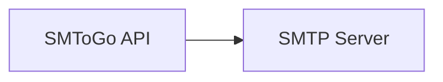

# SMToGo - High-Performance SMTP API Server

[](https://github.com/hnrobert/smtogo/actions/workflows/docker-image.yml)
[](https://goreportcard.com/report/github.com/hnrobert/smtogo)
[](https://opensource.org/licenses/MIT)

A high-performance SMTP API server written in Go, designed for reliable email sending.

> **Note**: This version focuses on core email functionality. File attachment support has been removed to simplify deployment and reduce dependencies.

## Features

- 🚀 **High Performance**: Built with Go and Gin framework for excellent performance
- 📧 **SMTP Support**: Full SMTP configuration with SSL/TLS support
- 🔐 **Optional Authentication**: API key-based authentication (optional)
- 📊 **OpenAPI Documentation**: Built-in Swagger/ReDoc documentation
- 🐳 **Docker Ready**: Complete Docker and Docker Compose setup
- 🔄 **CI/CD**: GitHub Actions workflow for testing and deployment
- 📝 **JSONC Configuration**: Support for JSON with comments configuration files
- 🏥 **Health Checks**: Built-in health check endpoints
- 📈 **Structured Logging**: Comprehensive logging and request tracking

## Quick Start

### Using Docker Compose (Recommended)

1. **Clone the repository**:

   ```bash
   git clone https://github.com/hnrobert/smtogo.git
   cd smtogo
   ```

2. **Configure SMTP settings**:

   ```bash
   cp config/smtp_config.jsonc.example config/smtp_config.jsonc
   # Edit config/smtp_config.jsonc with your SMTP server details
   ```

3. **Start the service**:

   ```bash
   docker-compose up -d
   ```

4. **Access the service**:
   - API Server: <http://localhost:8000>
   - API Documentation: <http://localhost:8000/docs>

### Manual Installation

1. **Prerequisites**:

   - Go 1.21 or later

2. **Install dependencies**:

   ```bash
   go mod download
   ```

3. **Configure the application**:

   ```bash
   cp config/smtp_config.jsonc.example config/smtp_config.jsonc
   # Edit the configuration file
   ```

4. **Run the application**:

```bash
go run cmd/smtogo/main.go
```

## Configuration

The application uses a JSONC configuration file (`config/smtp_config.jsonc`) that supports comments:

```jsonc
{
  // API Configuration
  "api_key": "", // Optional: API key for authentication
  "api_name": "High-Performance SMTP API",
  "api_description": "SMTP API mail dispatch with support for attachments.",

  // SMTP Server Settings
  "smtp_server": "smtp.example.com",
  "smtp_port": 587,
  "use_ssl": false,
  "use_password": true,
  "use_tls": true,

  // Email Limits
  "max_len_recipient_email": 64,
  "max_len_subject": 255,
  "max_len_body": 50000,

  // Sender Configuration
  "sender_email": "sender@example.com",
  "sender_email_display": "Display Name <sender@example.com>",
  "sender_domain": "example.com",
  "sender_password": "your_smtp_password"
}
```

### Environment Variables

You can also configure the application using environment variables:

- `SMTP_SERVER`: SMTP server hostname
- `SMTP_PORT`: SMTP server port
- `SENDER_EMAIL`: Sender email address
- `SENDER_PASSWORD`: SMTP password
- `API_KEY`: Optional API key for authentication

## API Usage

### Send Email

```bash
curl -X POST http://localhost:8000/v1/mail/send \
  -H "Content-Type: application/json" \
  -H "X-API-Key: your-api-key" \
  -d '{
    "recipient_email": "recipient@example.com",
    "subject": "Test Email",
    "body": "This is a test email",
    "body_type": "plain"
  }'
```

### API Response

```json
{
  "message": "Email is being sent in the background",
  "email_id": "123e4567-e89b-12d3-a456-426614174000"
}
```

## Architecture



### Project Structure

```text
smtogo/
├── src/app/
│   ├── cmd/smtogo/      # Application entry point
│   └── internal/
│       ├── api/         # HTTP handlers and routing
│       ├── config/      # Configuration management
│       ├── email/       # Email sending logic
│       └── models/      # Data structures
├── src/docker/          # Docker configuration
├── .github/workflows/   # CI/CD pipelines
├── docker-compose.yml   # Docker orchestration
└── README.md
```

## Development

### Running Tests

```bash
# Run all tests
go test ./...

# Run tests with coverage
go test -cover ./...

# Run tests with race detection
go test -race ./...
```

### Code Quality

```bash
# Format code
go fmt ./...

# Vet code
go vet ./...

# Run linter (install golangci-lint first)
golangci-lint run
```

### Building

```bash
# Build for current platform
go build -o smtogo ./cmd/smtogo

# Build for Linux
GOOS=linux GOARCH=amd64 go build -o smtogo-linux ./cmd/smtogo

# Build Docker image
docker build -t smtogo .
```

## Deployment

### Docker Deployment

The application uses pre-built Docker images from GitHub Container Registry:

1. **Deploy with docker-compose**:

   ```bash
   docker-compose up -d
   ```

2. **Or run directly with Docker**:

   ```bash
   docker run -d \
     -p 8000:8000 \
     -v ./config:/app/config \
     -v ./data:/app/data \
     ghcr.io/hnrobert/smtogo:latest
   ```

### Kubernetes Deployment

See the `k8s/` directory for Kubernetes manifests.

### Production Considerations

- Use strong API keys for authentication
- Configure TLS/SSL for SMTP connections
- Set up proper logging and monitoring
- Set up backup strategies for email logs
- Configure reverse proxy for production deployment

## Monitoring

### Health Checks

- `GET /health`: Basic health check

### Metrics

The application exposes metrics endpoints for monitoring:

- Request/response times
- Email sending success/failure rates
- SMTP connection health

## Security

- Optional API key authentication
- Input validation and sanitization
- SMTP credential protection
- Container security best practices

## Contributing

1. Fork the repository
2. Create a feature branch (`git checkout -b feature/amazing-feature`)
3. Commit your changes (`git commit -m 'Add some amazing feature'`)
4. Push to the branch (`git push origin feature/amazing-feature`)
5. Open a Pull Request

## License

This project is licensed under the MIT License - see the [LICENSE](LICENSE) file for details.

## Support

- 📧 Email: <support@example.com>
- 💬 Issues: [GitHub Issues](https://github.com/hnrobert/smtogo/issues)
- 📖 Documentation: [API Docs](http://localhost:8000/docs)

## Changelog

See [CHANGELOG.md](CHANGELOG.md) for a detailed history of changes.

---

Made with ❤️ by [Your Name](https://github.com/hnrobert)
